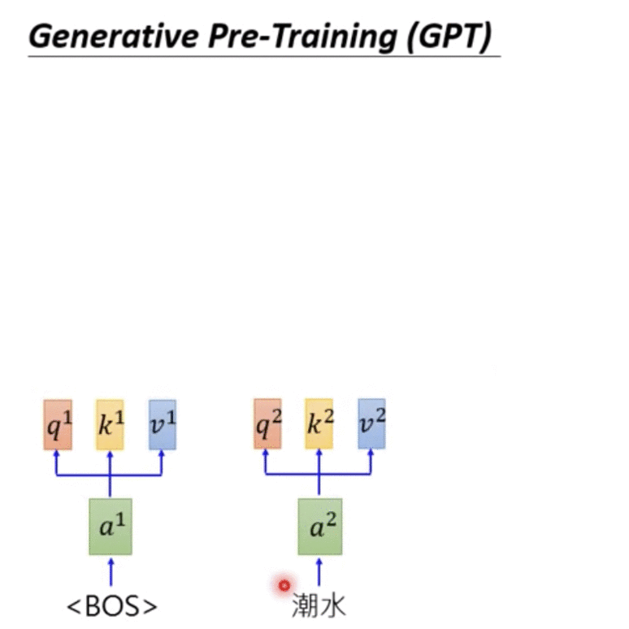

# 前置知識：ELMO / BERT / GPT

機器對詞彙的理解，從簡單到複雜：

* 1-of-N encoding
* word class
* word embedding

Word Embedding 怎麼來？

為了同樣的詞**在不同的上下文**中，機器能夠理解他們有不同的語義、產生不同的 embedding；因此產生 Contextualized Word Embedding

* 每一個 word token 都有自己的 embedding 
*  embedding 的產生和上下文有關 

## ELMO: Embeddings from Language Model

#### 怎麼訓練的？

* 大約 94M 參數
* 給定一大堆句子，訓練 RNN-based model 預測下一個詞要接什麼
* RNN 最後輸出的向量就可代表該詞彙「考慮過上下文後」的 embedding

.png>)

.png>)

.png>)

如果我們的 RNN 不只一層，有很多層（常見），會根據後面要做的任務，訓練不同層的 embedding 權重：

.png>)

h1, h2, ... 各層 embedding 分別乘上權重 a1, a2, ...，以後面應用的任務決定權重

.png>)

## BERT: Bidirectional Encoder Representation from Transformers

.png>)

* 大約 340M 參數
* BERT 是來自於訓練 Transformer 架構中的 **Encoder**
* 非監督式訓練模型：訓練 BERT 只需要訓練 Tranformer 中的 encoder，因此不需要有 labeled-data，只需要大量的文本
* 輸入一段文本，BERT 模型會輸出一段 embedding，每個 embedding 對應到一個字
* 訓練中文 BERT 時用「字」當作單位更恰當，因為「詞彙」的組合有無限多種（input 的 one-hot-encoding維度會過高），但「字」是有限集合

### BERT 是怎麼被訓練出來？

文獻中，以下兩個訓練任務需一起做，會使得 BERT 效果更好

#### 1. Masked Language Model 

* Masked LM?  
  * 克漏字問題，訓練 BERT 進行填空
* 將挖空處的 embedding 後面接一個很簡單的 Linear Classifier （多類別表示各個字符合填空處的機率值），目的是讓這個被挖空的字的 BERT representation （可能是很多層的 transformer encoder）必須要盡量最好，才能有好的預測。
* 如果填入的詞彙不違和，說明他們有相近的 embedding

.png>)

#### 2. Next Sentence Prediction

* \[SEP]：上下句斷句的位置標記（類似逗點的作用）
* \[CLS]：輸出分類結果的位置標記，通常放在句子開頭；這個位置輸出的 embedding 會接上一個 Linear Binary Classifier，和 BERT 一起被訓練，分類這兩句是否是合理的上下句
  * 放在開頭、中間、結尾其實沒有差，因為 BERT 內部是 Transformer Encoder 的架構，也就是使用 Self-Attention 機制，字元間的距離沒有差別，都會被模型所參考。

.png>)

### 如何應用 BERT？

大概念：使用 BERT 作為特徵轉換，後面再接不同任務所需的模型

#### 文本分類

* 文本輸入 BERT、label 是 linear classifier 的輸出
* BERT 和 Linear classifier 一起訓練，BERT 只需要 fine-tune 超參數，Linear classifier 則從頭訓練

.png>)

#### 詞性標注

.png>)

#### 自然語意推論 Natural Language Inference ([NLI](https://hsiaoyetgun.github.io/2018/08/06/Natural-Language-Inference-%E5%AD%A6%E4%B9%A0%E7%AC%94%E8%AE%B0/))

* 給定兩個句子，上句是前提 (premise)，下句是假設 (Hypothesis)，模型要根據前提推論假設與前提的關係
* 分類為三種關係：蕴含关系 (Entailment)、矛盾关系 (Contradiction)、中立关系 (Neutral)

.png>)

#### Extraction-based Question Answering (SQuAD)

問題所問的答案是文本中提過的關鍵詞

* 輸入：
  * \[CLS] 一個問題的 token 集合 Q \[SEP] 一個文本的 token 集合 D 
* 輸出：
  * 答案在文本集合 D 的 token 位置區間 (s, e)
    * 如果 s > e ，表示問題無解，答案不在文本中

.png>)

* 橘色和藍色向量是經由很多問題和文本，從0訓練出的向量
* 橘色向量：代表答案所在的起始位置，將訓練好的橘色向量和要被預測的文本 token embedding 做內積
* 藍色向量：代表答案所在的結束位置，將訓練好的藍色向量和要被預測的文本 token embedding 做內積

.png>)

## ERNIE: Enhanced Representation through Knowledge Integration

* 是 BERT 的朋友，專門為中文設計
* BERT 的 Masked LM 是訓練克漏字，ERNIE 則是訓練克漏詞

## Multilingual BERT

* 用 104 種語言的維基百科文章訓練

## Generative Pre-Training (GPT)

* 大約 1542M 參數
* 來自於訓練 Transformer 的 **Decoder**
* GPT-2 可以在完全沒有訓練資料的情形下，可以做到：
  * Reading Comprehension 文本理解：QA 任務，成效不錯
  * Summarization 文本摘要，但成效不好
  * Translation 文本翻譯，但成效不好
  * 自動生成文章後續，OpenAI 有做一個參數規模更大的 GPT model 但沒發表因為說功能太強大，會被用來生成很多假新聞
    * demo website: [talktotransformer.com](https://app.inferkit.com/demo) using GPT-2

## References

* \[DLHLP 2020] ELMO, BERT, GPT (Hung-yi Lee): [https://www.youtube.com/watch?v=UYPa347-DdE](https://www.youtube.com/watch?v=UYPa347-DdE)

