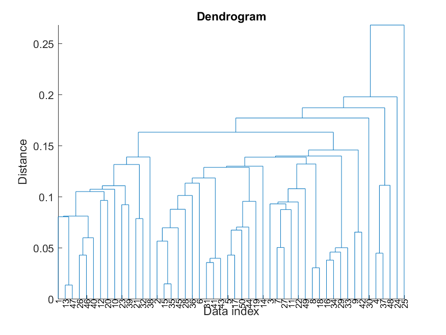

# 分群：階層式分群 Hierarchical Clustering

### 何謂階層式分群？

* 概念：測量樣本點間的距離後，以樹狀資料結構進行聚類。
* 優缺點
  * :thumbsup:以樹狀結構表示計算過程更易懂
  * :thumbsup:只以樣本間的距離就可以進行，無需樣本的實際座標位置
  * :thumbsdown:適合少量樣本，面對大量資料時效能不佳
* 決定距離計算方式：
  * 歐式距離
  * 餘弦距離
  * 曼哈頓距離
  * 漢明距離
* 分群判讀方式：**樹狀圖 dendrogram**
  * **在指定高度上水平切割樹狀圖，可得相對應的分群結果**

* 優化分群結果：修剪樹狀結構

根據聚合方式又分為 Top-down 及 Bottom-up 兩種算法：

#### (a)  Top-down（由上而下分裂）：分裂式階層分群法（divisive hierarchical clustering）

將所有樣本作為一個整體分類，然後逐漸細分。

以 R 語言中的 `diana` 套件為例，

#### (b)  Bottom-up（由下而上聚合）：聚合式階層分群法（agglomerative hierarchical clustering）

將每個樣本視為一個群聚，從樹狀結構底部不斷融合相近的樣本；假如生成的群數多於我們預期的群數，則反覆重複聚合**最近距離的兩群**的動作，直到群數降到條件範圍內。

* 若群內有多個樣本，該如何定義兩群間的距離？在階層式分群中有 6 種距離定義方式：
  * Single Linkage：群與群的距離為不同群中**最接近兩點間的距離**，容易產生大者恆大的分群結果。
  * Average Linkage：群與群的距離為不同群中**各點與各點間距離總和平均**，相比 Single Linkage 則較容易產生齊頭並進、各群規模相近的分群結果。
  * Complete Linkage：群與群的距離為不同群中**最遠兩點間的距離**
  * Ward's Method：**將兩群合併後，各點到合併後的群中心的距離平方和**
  * Weighted Average Linkage
  * UPGMA


資料來源：

* [3-2 Hierarchical Clustering (階層式分群法)](http://mirlab.org/jang/books/dcpr/dcHierClustering.asp?title=3-2%20Hierarchical%20Clustering%20\(%B6%A5%BCh%A6%A1%A4%C0%B8s%AAk\)\&language=chinese)，
* [agnes: Agglomerative Nesting (Hierarchical Clustering)](https://www.rdocumentation.org/packages/cluster/versions/2.1.2/topics/agnes), RDocumentation, Datacamp
* [UPGMA](https://baike.baidu.com/item/UPGMA/9491197)｜百度百科


